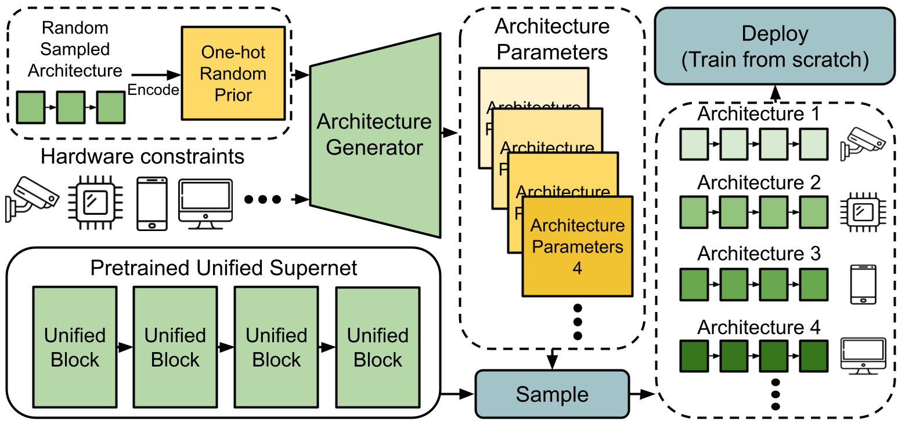

# [CVPR2021] Searching by Generating: Flexible and Efficient One-Shot NAS with Architecture Generator
## Overview
This is the entire codebase for the paper **Searching by Generating: Flexible and Efficient One-Shot NAS with Architecture Generator**

In one-shot NAS, sub-networks need to be searched from the supernet to meet different hardware constraints. However, the search cost is high and N times of searches are needed for N different constraints. In this work, we propose a novel search strategy called architecture generator to search sub-networks by generating them, so that the search process can be much more efficient and flexible. With the trained architecture generator, given target hardware constraints as the input, N good architectures can be generated for N constraints by just one forward pass without researching and supernet retraining. Moreover, we propose a novel single-path supernet, called unified supernet, to further improve search efficiency and reduce GPU memory consumption of the architecture generator. With the architecture generator and the unified supernet, we pro-
pose a flexible and efficient one-shot NAS framework, called Searching by Generating NAS (SGNAS). The search time of SGNAS for N different hardware constraints is only 5 GPU hours, which is 4N times faster than previous SOTA single-path methods. The top1-accuracy of SGNAS on ImageNet is 77.1%, which is comparable with the SOTAs.




## Model Zoo
|  Model  |  FLOPs (M) | Param (M) | Top-1 (%) | Weights |
|:-------:|:----------:|:---------:|:---------:|:-------:|
| SGNAS-A |     373    |    6.0    |    77.1   |  [Google drive](https://drive.google.com/file/d/10SBC1nm4n41zpvnQuJfQd8lvV0BlDJhu/view?usp=sharing)   |
| SGNAS-B |     326    |    5.5    |    76.8   |  [Google drive](https://drive.google.com/file/d/1g-evYXON8ZYmHZKS6LUQs9H0dBbfdrkj/view?usp=sharing)   |
| SGNAS-C |     281    |    4.7    |    76.2   |  [Google drive](https://drive.google.com/file/d/1x03lQEGQXue9DWVVQDEIS6Hn15sQh_wf/view?usp=sharing)   |

## Requirements
```
pip3 install -r requirements.txt
```
- <b>[Optional]</b> Transfer Imagenet dataset into LMDB format by ```utils/folder2lmdb.py```
    - With LMDB format, you can speed up entire training process(30 mins per epoch with 4 GeForce GTX 1080 Ti)

## Getting Started
### Search
#### Training Unified Supernet（当warmup eps 不为0时执行本步）
* For Imagenet training, set the config file `./config_file/imagenet_config.yml`. For cifar100 training, set the config file `./config_file/config.yml`.
* Set the hyperparameter `warmup_epochs` in the config file to specific the epochs for training the unified supernet.
* **warmup_epochs表示训练supernet的轮数，若为0跳过supernet training直接进入到generator训练环节**

```
python3 search.py --cfg [CONFIG_FILE] --title [EXPERIMENT_TITLE]
```
#### Training Architecture Generator
* For Imagenet training, set the config file `./config_file/imagenet_config.yml`. For cifar100 training, set the config file `./config_file/config.yml`.
* Set the hyperparameter `warmup_epochs` to 0 in the config file to **skip the supernet training**, and set the hyperparameter `search_epochs` to specific the epochs for training the architecture generator.
```
python3 search.py --cfg [CONFIG_FILE] --title [EXPERIMENT_TITLE]
```

### Train From Scratch
#### CIFAR10 or CIFAR100
* Set `train_portion` in `./config_file/config.yml` to `1`
```
python3 train_cifar.py --cfg [CONFIG_FILE] -- flops [TARGET_FLOPS] --title [EXPERIMENT_TITLE]
```
#### ImageNet
* Set the target flops and correspond config file path in `run_example.sh`
```
bash ./run_example.sh
```

### Validate
#### ImageNet
* SGNAS-A
``` SGNAS-A
python3 validate.py [VAL_PATH] --checkpoint [CHECKPOINT_PATH] --config_path [CONFIG_FILE] --target_flops 365 --se True --activation hswish
```
* SGNAS-B
``` SGNAS-B
python3 validate.py [VAL_PATH] --checkpoint [CHECKPOINT_PATH] --config_path [CONFIG_FILE] --target_flops 320 --se True --activation hswish
```
* SGNAS-C
``` SGNAS-C
python3 validate.py [VAL_PATH] --checkpoint [CHECKPOINT_PATH] --config_path [CONFIG_FILE] --target_flops 275 --se True --activation hswish
```

## Reference
* [DNA](https://github.com/changlin31/DNA)
* [Efficient-Pytorch](https://github.com/Lyken17/Efficient-PyTorch)
* [Image2LMDB](https://github.com/Fangyh09/Image2LMDB)
* [pytorch-image-models](https://github.com/rwightman/pytorch-image-models/)
* [slimmable_networks](https://github.com/JiahuiYu/slimmable_networks/blob/master/utils/config.py)

## Citation
```
@InProceedings{sgnas,
author = {Sian-Yao Huang and Wei-Ta Chu},
title = {Searching by Generating: Flexible and Efficient One-Shot NAS with Architecture Generator},
booktitle = {Proceedings of IEEE Conference on Computer Vision and Pattern Recognition},
year = {2021}
}
```
